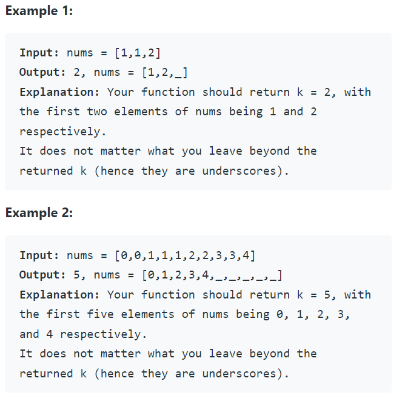

Problem Link : https://leetcode.com/problems/remove-duplicates-from-sorted-array/
<br>
Given an integer array nums sorted in non-decreasing order, remove the duplicates in-place such that each unique element appears only once. The relative order of the elements should be kept the same.
<br>


<br>

Solution : 
<br>
Two Pointer :

i) In this problem, the key point to focus on is the input array being sorted.<br>
ii) We need to modify the array in-place and the size of the final array would potentially be smaller than the size of the input array. So, we ought to use a two-pointer approach here. One, that would keep track of the current element in the original array and another one for just the unique elements. <br>

Code: 

```
class Solution {
public:
    int removeDuplicates(vector<int>& nums) {
        if(nums.size() == 1) return 1;
        int i = 0;
        int j = 1;
        int cnt = 1;
        while(i < nums.size() && j < nums.size()){
            if(nums[i] == nums[j]){
                j++;
            }
            else{
                swap(nums[i+1], nums[j]);
                i++;
                j++;
                cnt++;
            }
        }
        return  cnt;
    }
};

```


Time Complexity : O(n)
Space Complexity : O(1)