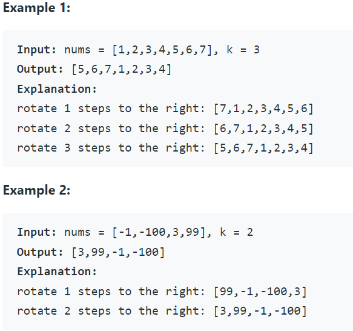

Problem Link : https://leetcode.com/problems/rotate-array/ <br>


Problem Statement:

Given an array, rotate the array to the right by k steps, where k is non-negative.<br>

 <br>

Solution : 

```
class Solution {
public:
    void reverse(vector<int>& arr, int start, int end){
        int i = start;
        int j = end;
        while(i < j){
            swap(arr[i], arr[j]);
            i++;
            j--;
        }
    }
    void rotate(vector<int>& nums, int k) {
       int n = nums.size();
       k = k%n;
        
        reverse(nums, n-k, n-1);
        reverse(nums, 0, n-k-1);
        reverse(nums, 0, n-1);
    }
};

```

Time Complexity : O(n)
Space Complexit : O(1)