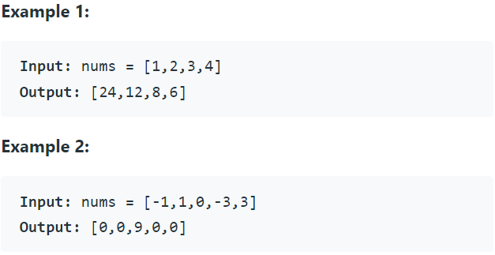

Problem Link : https://leetcode.com/problems/product-of-array-except-self/

Problem Statement : Given an integer array nums, return an array answer such that answer[i] is equal to the product of all the elements of nums except nums[i].

The product of any prefix or suffix of nums is guaranteed to fit in a 32-bit integer.

You must write an algorithm that runs in O(n) time and without using the division operation.



Solution : 

```
class Solution {
public:
    vector<int> productExceptSelf(vector<int>& nums) {
        int n = nums.size();
        vector<int> ans(n, 1);
        int curr = 1;
        for(int i=0;i<n;i++){
            ans[i] = ans[i] * curr;
            curr = curr* nums[i];
        }
        curr = 1;
        for(int i=n-1;i>=0;i--){
            ans[i] = ans[i] * curr;
            curr = curr * nums[i];
        }
        return ans;
    }
};
```

1) TC : O(n)<br>
2) SC : O(1)